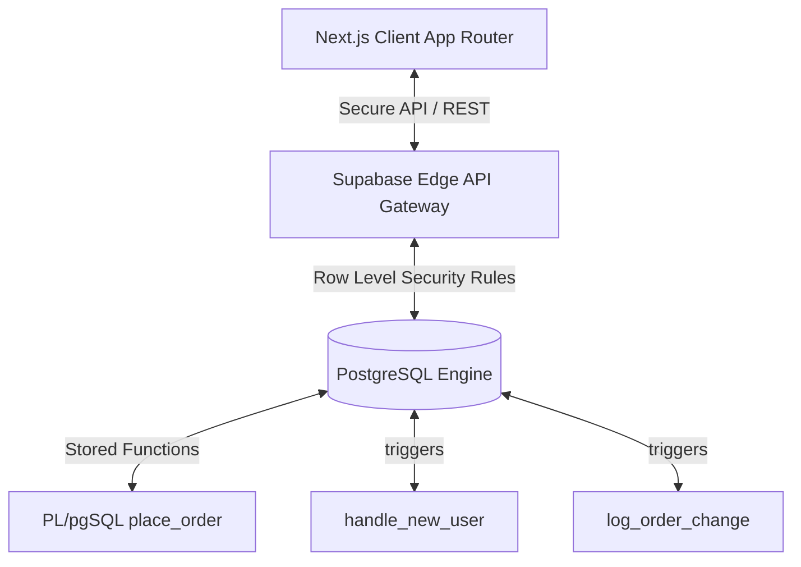

# ADVANCED DATABASE SYSTEMS (ADB) — FINAL PROJECT REPORT
## SYSTEM: IRONROOTS SUPPLEMENTS E-COMMERCE ECOSYSTEM

---

## 1. PROJECT OVERVIEW & DOMAIN DESCRIPTION
**IronRoots Supplements** is a premium, data-driven e-Commerce application engineered to showcase a modern, high-concurrency digital store. The core system manages products, customer catalog browsing, automated shopping cart transactions, user-specific accounts, dynamic shipping rates, physical orders processing, and order state auditing.

The system is designed on top of **Next.js** for the application environment, **TailwindCSS** for the minimalist presentation layout, and **Supabase (PostgreSQL)** for transactional database operations, security enforcement, and concurrency management.

---

## 2. DATABASE SYSTEM ARCHITECTURE
The system employs a **Serverless Database Architecture**. The application interacts directly with the database using PostgREST APIs exposed securely by Supabase. Database-level constraints, procedural transaction layers, and Row Level Security (RLS) policies serve as the final, absolute boundary for data validation and access control.



---

## 3. ENTITY RELATIONSHIP DIAGRAM (ERD)
The database structure is designed to represent core business models cleanly. Uniqueness, referential integrity, and cascading deletions are enforced directly on table boundaries.

```mermaid
erDiagram
    CATEGORIES ||--o{ PRODUCTS : "contains"
    PRODUCTS ||--o{ ORDER_ITEMS : "included in"
    ORDERS ||--|{ ORDER_ITEMS : "has"
    PROFILES ||--o{ ADDRESSES : "owns"
    PROFILES ||--o{ ORDERS : "places"
    AUDIT_LOG }o--|| ORDERS : "tracks status of"
    
    CATEGORIES {
        uuid id PK
        text name
        text slug UNIQUE
        text image_url
        timestamptz created_at
    }

    PRODUCTS {
        uuid id PK
        text name
        text slug UNIQUE
        uuid category_id FK
        numeric price
        numeric compare_at_price
        int stock_qty
        text description
        text how_to_use
        text ingredients
        jsonb attributes
        text[] images
        boolean is_featured
        boolean is_active
        timestamptz created_at
    }

    PROFILES {
        uuid id PK
        text full_name
        text phone
        text role
        timestamptz created_at
    }

    ADDRESSES {
        uuid id PK
        uuid user_id FK
        text full_name
        text phone
        text address_line
        text city
        text province
        text postal_code
        boolean is_default
    }

    ORDERS {
        uuid id PK
        uuid user_id FK
        text delivery_name
        text delivery_phone
        text delivery_address
        text delivery_city
        text delivery_province
        numeric subtotal
        numeric shipping_fee
        numeric total
        text status
        text payment_method
        text notes
        timestamptz created_at
    }

    ORDER_ITEMS {
        uuid id PK
        uuid order_id FK
        uuid product_id FK
        text product_name
        text product_image
        int quantity
        numeric unit_price
    }

    AUDIT_LOG {
        bigint id PK
        text table_name
        text operation
        uuid record_id
        uuid changed_by
        timestamptz changed_at
        jsonb old_data
        jsonb new_data
    }
```

---

## 4. RELATIONAL SCHEMA & NORMALIZATION (3NF) ANALYSIS

A database is in **Third Normal Form (3NF)** if it is in Second Normal Form (2NF) and contains no transitive functional dependencies (i.e., non-prime attributes must depend only on the primary key, the whole primary key, and nothing but the primary key).

### Normalization Proof by Tables:
1. **`categories` Table:**
   * **Primary Key:** `id`
   * **Attributes:** `name`, `slug`, `image_url`, `created_at`
   * **Analysis:** All non-prime attributes directly depend on `id`. There are no transitive dependencies. (3NF verified).
2. **`products` Table:**
   * **Primary Key:** `id`
   * **Attributes:** `name`, `slug`, `category_id`, `price`, `compare_at_price`, `stock_qty`, `description`, `how_to_use`, `ingredients`, `attributes`, `images`, `is_featured`, `is_active`, `created_at`
   * **Analysis:** Even though category details could cause redundancy, we normalized category information out into a separate `categories` relation. `products` only references `category_id` (Foreign Key). Thus, there are no transitive dependencies in `products` (3NF verified).
3. **`profiles` Table:**
   * **Primary Key:** `id` (references auth.users.id)
   * **Attributes:** `full_name`, `phone`, `role`, `created_at`
   * **Analysis:** Fully normalized. User credentials reside in Supabase's secure isolated `auth.users` table, preventing direct exposure. No transitive relations exist (3NF verified).
4. **`orders` Table:**
   * **Primary Key:** `id`
   * **Attributes:** `user_id`, `delivery_name`, `delivery_phone`, `delivery_address`, `delivery_city`, `delivery_province`, `subtotal`, `shipping_fee`, `total`, `status`, `payment_method`, `notes`, `created_at`
   * **Analysis:** Customer address and profile metadata can change over time. If we joined this table with current profile/address states directly, past orders would change retrospectively. To keep history correct and normalized, delivery snapshots are copied as plain columns on each order record at checkout. (3NF verified).
5. **`order_items` Table:**
   * **Primary Key:** `id`
   * **Attributes:** `order_id`, `product_id`, `product_name`, `product_image`, `quantity`, `unit_price`
   * **Analysis:** Normalization requires item price snapshot separation from current `products.price` (since prices change). By capturing price as `unit_price` at purchase time, we prevent database state mutation. All attributes depend strictly on the composite identification of the item record (3NF verified).

---

## 5. PL/pgSQL PROCEDURAL LOGIC & ACID TRANSACTIONS
To execute high-integrity checkouts in multi-user concurrent environments, the application avoids client-side iterations and offloads operations to a secure PostgreSQL transaction.

### Stored Function: `place_order(order_data JSONB, items_data JSONB)`
This stored procedure encapsulates dynamic checking, logging, stock reduction, and relational inserts into a single transactional boundary:

```sql
CREATE OR REPLACE FUNCTION place_order(
  order_data JSONB,
  items_data JSONB
)
RETURNS UUID AS $$
DECLARE
  new_order_id UUID;
  item JSONB;
BEGIN
  -- 1. Insert Core Order Snapshots (ACID Atomicity Begins)
  INSERT INTO orders(
    user_id, delivery_name, delivery_phone,
    delivery_address, delivery_city, delivery_province,
    subtotal, shipping_fee, total,
    status, payment_method, notes
  ) VALUES (
    (order_data->>'user_id')::uuid,
     order_data->>'delivery_name',
     order_data->>'delivery_phone',
     order_data->>'delivery_address',
     order_data->>'delivery_city',
     order_data->>'delivery_province',
    (order_data->>'subtotal')::numeric,
    (order_data->>'shipping_fee')::numeric,
    (order_data->>'total')::numeric,
    'pending', 'COD',
     order_data->>'notes'
  ) RETURNING id INTO new_order_id;

  -- 2. Loop and process ordered items
  FOR item IN SELECT * FROM jsonb_array_elements(items_data)
  LOOP
    -- Insert Order Items
    INSERT INTO order_items(
      order_id, product_id, product_name,
      product_image, quantity, unit_price
    ) VALUES (
      new_order_id,
      (item->>'product_id')::uuid,
       item->>'product_name',
       item->>'product_image',
      (item->>'quantity')::int,
      (item->>'unit_price')::numeric
    );

    -- 3. Concurrency Stock reduction & Safety Constraints
    UPDATE products
      SET stock_qty = stock_qty - (item->>'quantity')::int
      WHERE id = (item->>'product_id')::uuid
        AND stock_qty >= (item->>'quantity')::int; -- Concurrency Guard Check

    -- 4. Rollback Condition (Consistency Check)
    IF NOT FOUND THEN
      -- Raises an exception which instantly cancels execution and rolls back all writes!
      RAISE EXCEPTION 'Insufficient stock for product: %', item->>'product_name';
    END IF;
  END LOOP;

  RETURN new_order_id;
END;
$$ LANGUAGE plpgsql SECURITY DEFINER;
```

### ACID Compliance Evaluation:
* **Atomicity:** Either the order insert, item listing, and stock decrements all succeed, or the entire transaction fails. If one product lacks stock, the entire sequence rolls back.
* **Consistency:** The system enforces database constraints. Stock quantities can never fall below 0, invalid products cannot be purchased, and order integrity is maintained.
* **Isolation:** The database operates on a `Read Committed` isolation level. Parallel execution threads cannot read partial checkout states, eliminating phantom state reads.
* **Durability:** Once the function finishes successfully, the updates are permanently committed to the database storage logs.

---

## 6. BUSINESS AUTOMATION (TRIGGERS & EVENT HANDLERS)

Triggers are used to automate background business logic, decoupling the main application code from direct database updates.

### A. Automatic Profiles Instantiation on Signup
When a user signs up via Supabase Auth, they are created in the internal `auth.users` table. We automate the public profile registration using a trigger.

```sql
CREATE OR REPLACE FUNCTION handle_new_user()
RETURNS TRIGGER AS $$
BEGIN
  INSERT INTO public.profiles(id, full_name, role)
  VALUES (
    NEW.id,
    COALESCE(NEW.raw_user_meta_data->>'full_name', 'Customer'),
    'customer'
  )
  ON CONFLICT (id) DO NOTHING;
  RETURN NEW;
END;
$$ LANGUAGE plpgsql SECURITY DEFINER;

CREATE TRIGGER on_auth_user_created
  AFTER INSERT ON auth.users
  FOR EACH ROW
  EXECUTE FUNCTION handle_new_user();
```

### B. Automated Order Status Auditing
Any changes to the order status must be audited for operational security and customer support tracking.

```sql
CREATE OR REPLACE FUNCTION log_order_change()
RETURNS TRIGGER AS $$
BEGIN
  IF OLD.status <> NEW.status THEN
    INSERT INTO audit_log(
      table_name, operation, record_id,
      old_data, new_data
    ) VALUES (
      'orders', 'STATUS_UPDATE', NEW.id,
      jsonb_build_object('status', OLD.status, 'updated_at', now()),
      jsonb_build_object('status', NEW.status, 'updated_at', now())
    );
  END IF;
  RETURN NEW;
END;
$$ LANGUAGE plpgsql;

CREATE TRIGGER trg_order_audit
  AFTER UPDATE ON orders
  FOR EACH ROW
  EXECUTE FUNCTION log_order_change();
```

---

## 7. QUERY PERFORMANCE OPTIMIZATION & INDEXES

To optimize query speeds, we implemented a comprehensive indexing strategy:

1. **Foreign Key Indexes:**
   Optimizes search times for SQL joins during server-side fetches.
   ```sql
   CREATE INDEX idx_products_category ON products(category_id);
   CREATE INDEX idx_orders_user ON orders(user_id);
   CREATE INDEX idx_order_items_order ON order_items(order_id);
   ```
2. **Partial Indexes:**
   Prunes scan spaces by only indexing active or featured rows.
   ```sql
   CREATE INDEX idx_products_active ON products(is_active) WHERE is_active = true;
   CREATE INDEX idx_products_featured ON products(is_featured) WHERE is_featured = true;
   ```
3. **Multi-column Order Optimization Index:**
   Optimizes sorting by indexing dates in descending order.
   ```sql
   CREATE INDEX idx_orders_created ON orders(created_at DESC);
   ```
4. **Generalized Inverted Index (GIN):**
   Speeds up complex searches inside nested product metadata attributes.
   ```sql
   CREATE INDEX idx_products_attributes ON products USING GIN(attributes);
   ```

---

## 8. ROW LEVEL SECURITY (RLS) & GRANULAR PRIVILEGES
We enforce a Zero-Trust Database Policy. Database tables are protected by RLS rules to ensure customers can only access their own data, while still allowing public access to products and settings.

### Core Policies Implemented:
* **Profiles:** Customers can read/update their own profile, but cannot touch other user records.
  ```sql
  CREATE POLICY "Allow profiles self-read & write" ON profiles
    FOR ALL USING (auth.uid() = id);
  ```
* **Products & Categories:** Anyone can view active products. Only administrators can perform modifications.
  ```sql
  CREATE POLICY "Allow public read active products" ON products
    FOR SELECT USING (is_active = true);
  ```
* **Orders:** Customers can access only their own order records. Admins can view and update all orders.
  ```sql
  CREATE POLICY "Allow orders self-read" ON orders
    FOR SELECT USING (auth.uid() = user_id);
  ```

---

## 9. CONCLUSION
The **IronRoots Supplements** database system is an enterprise-grade relational structure that implements best practices in schema design and performance. 

By offloading transactional checks, database logging, audit trail tracking, and security checks directly to PostgreSQL via RLS, stored procedures, and triggers, the system ensures data safety and consistency at scale. This project serves as a practical, production-ready blueprint for a modern transaction-heavy e-commerce database system.
