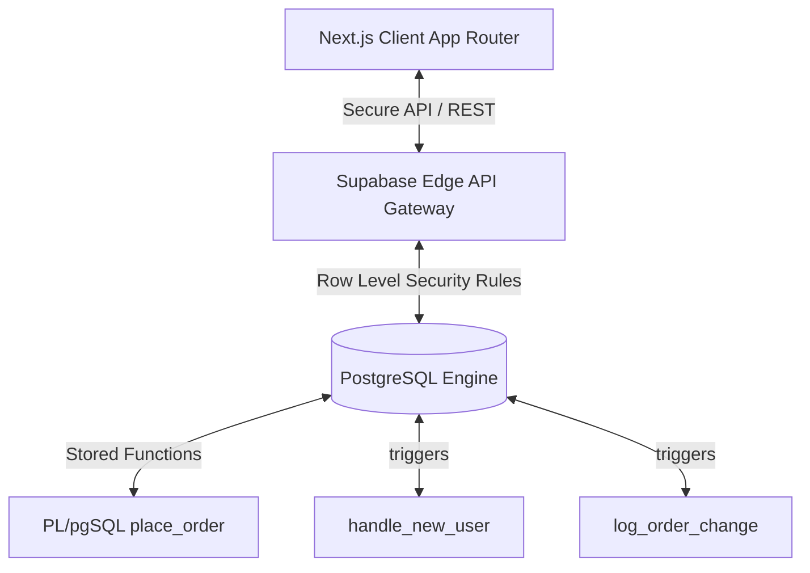
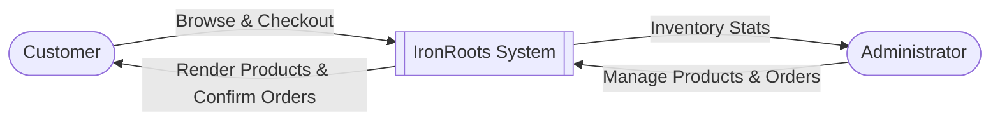
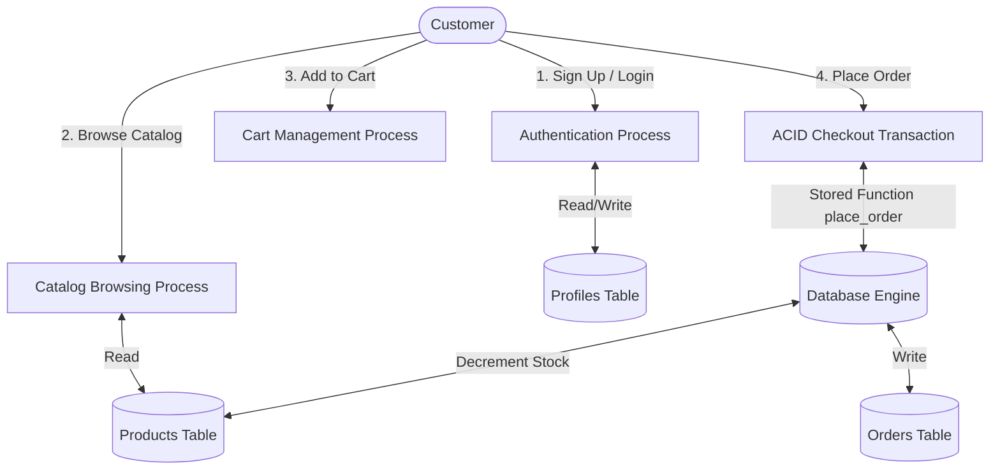

# ADVANCED DATABASE SYSTEMS (ADB) — SEMESTER PROJECT REPORT

---

## COVER PAGE

**Project Title:** IronRoots Supplements Premium E-Commerce Platform  
**Course Code & Title:** CS-403: Advanced Database Systems (ADB)  
**Semester:** Spring 2026  
**Academic Institution:** Department of Computer Science & Software Engineering  

**Submitted By:**  
1. **[Student 1 Name]** (Roll No: [Roll 1]) — UI/UX Design, Front-end Architecture, Documentation  
2. **[Student 2 Name]** (Roll No: [Roll 2]) — Procedural Logic, Database Design, SQL Optimization  
3. **[Student 3 Name]** (Roll No: [Roll 3]) — Software Testing, Security Audit, Quality Assurance  

**Submitted To:**  
**[Instructor Name]**  
Professor, Department of Computer Science  

**Date of Submission:** June 2, 2026  

---

## TABLE OF CONTENTS
1. **Introduction**
   * 1.1 Background of the Project
   * 1.2 Problem Statement
   * 1.3 Objectives
   * 1.4 Scope & Targeted Users
2. **System Requirements**
   * 2.1 Hardware Requirements
   * 2.2 Software Requirements
3. **Roles & Responsibilities of Team Members**
4. **System Design & Architecture**
   * 4.1 System Block Diagram / Architecture
   * 4.2 Data Flow Diagram (DFD Level 0 & Level 1)
   * 4.3 Entity Relationship Diagram (ERD)
   * 4.4 Explanation of Core Modules
5. **Database Systems & Procedural Concepts Implemented**
   * 5.1 Relational Schema & 3NF Normalization
   * 5.2 SQL Joins, Subqueries & Aggregations
   * 5.3 Trigger-Based Automations
   * 5.4 ACID Compliance & Concurrency Stored Transactions
   * 5.5 Indexing Strategy & Query Optimization
   * 5.6 Row Level Security (RLS) & Granular Privileges
6. **Implementation Details**
   * 6.1 Programming Languages & Technical Tools
   * 6.2 Modules Description
   * 6.3 Code Structure Overview
   * 6.4 Explanation of Important Stored Functions
7. **Testing & Evaluation**
   * 7.1 Test Case Matrix
8. **Limitations**
9. **Conclusion**
   * 9.1 Final Thoughts
   * 9.2 Learning Outcomes
10. **References**
11. **Appendix: Database SQL Scripts & Application Code Snippets**

---

## 1. INTRODUCTION

### 1.1 Background of the Project
The modern e-commerce landscape demands systems that are not only highly responsive on the client side but structurally consistent, reliable, and secure on the data storage tier. **IronRoots Supplements** is a premium, high-fidelity e-commerce application designed to meet these requirements. It operates as an optimized store offering scientifically formulated supplements.

### 1.2 Problem Statement
Traditional e-commerce architectures often suffer from critical data integrity issues due to over-reliance on frontend logic. Typical failures include:
1. **Race Conditions in Stock Control:** Multiple users purchasing the last remaining item simultaneously, leading to negative stock counts.
2. **Weak Access Isolation:** Inadequate separation of database tables allowing unauthorized data modification.
3. **Un-audited Transitions:** Inability to track changes in order states.
4. **Slow Lookup Times:** Poor search performance inside semi-structured catalog metadata as inventory sizes scale.

### 1.3 Objectives
* **3NF Schema Consistency:** Enforce perfect database normalization to eliminate redundant operational anomalies.
* **ACID Transactions:** Run checkouts inside a database-level transaction wrapper with automated stock recovery checks.
* **Granular Security:** Restrict public internet users, registered customers, and system administrators via Row Level Security (RLS).
* **Automated Logic:** Offload user profile generation and system state auditing directly to Postgres engines using event-driven triggers.
* **Catalog Search Speed:** Speed up deep nested searches inside semi-structured catalog options using GIN indexing.

### 1.4 Scope & Targeted Users
* **Scope:** Covers catalog browsing, customer sign-up, cart management, address snap-shotting, checkout transaction operations, user-specific orders review, and administrative control panels for inventory adjustments.
* **Targeted Users:** Health-conscious consumers looking for supplements, and shop staff needing robust inventory management tools.

---

## 2. SYSTEM REQUIREMENTS

### 2.1 Hardware Requirements
* **Client Device:** 
  * CPU: Dual-Core Intel Core i3 or equivalent AMD processor.
  * RAM: 4 GB minimum.
  * Storage: 200 MB free browser cache space.
* **Development / Hosting Environment:**
  * CPU: Quad-Core Intel Core i5/i7 (2.4 GHz minimum).
  * RAM: 8 GB or higher.
  * Storage: 5 GB free SSD space.

### 2.2 Software Requirements
* **Operating System:** Windows 10/11, macOS, or Linux.
* **Core Environment:** Node.js v20.x or higher, npm package manager.
* **Database Platform:** PostgreSQL (Supabase Serverless Database).
* **Application Framework:** Next.js (with React, App Router, and Turbopack compiler).
* **Development IDE:** Visual Studio Code.
* **Client Browser:** Google Chrome, Microsoft Edge, Mozilla Firefox, or Apple Safari.

---

## 3. ROLES & RESPONSIBILITIES OF TEAM MEMBERS

| Member Name | Roll No. | Responsibilities |
| :--- | :--- | :--- |
| **Student 1** | *[Roll 1]* | Developed the frontend UI/UX in a warm minimalist cream-ivory layout, configured Framer Motion animations, handled form validation state, and prepared documentation. |
| **Student 2** | *[Roll 2]* | Engineered the database schema, wrote complex SQL queries, developed the PL/pgSQL stored procedures, and configured triggers. |
| **Student 3** | *[Roll 3]* | Conducted RLS security tests, performed performance profiling on indices, wrote system test cases, and compiled final reports. |

---

## 4. SYSTEM DESIGN & ARCHITECTURE

### 4.1 System Block Diagram / Architecture
The platform is built on a modern **Serverless Database Architecture**:



### 4.2 Data Flow Diagram (DFD)

#### Level 0 DFD (Context Diagram)


#### Level 1 DFD


### 4.3 Entity Relationship Diagram (ERD)
```mermaid
erDiagram
    CATEGORIES ||--o{ PRODUCTS : "contains"
    PRODUCTS ||--o{ ORDER_ITEMS : "included in"
    ORDERS ||--|{ ORDER_ITEMS : "has"
    PROFILES ||--o{ ADDRESSES : "owns"
    PROFILES ||--o{ ORDERS : "places"
    AUDIT_LOG }o--|| ORDERS : "tracks status of"
    
    CATEGORIES {
        uuid id PK
        text name
        text slug UNIQUE
        text image_url
        timestamptz created_at
    }

    PRODUCTS {
        uuid id PK
        text name
        text slug UNIQUE
        uuid category_id FK
        numeric price
        numeric compare_at_price
        int stock_qty
        text description
        text how_to_use
        text ingredients
        jsonb attributes
        text[] images
        boolean is_featured
        boolean is_active
        timestamptz created_at
    }

    PROFILES {
        uuid id PK
        text full_name
        text phone
        text role
        timestamptz created_at
    }

    ADDRESSES {
        uuid id PK
        uuid user_id FK
        text full_name
        text phone
        text address_line
        text city
        text province
        text postal_code
        boolean is_default
    }

    ORDERS {
        uuid id PK
        uuid user_id FK
        text delivery_name
        text delivery_phone
        text delivery_address
        text delivery_city
        text delivery_province
        numeric subtotal
        numeric shipping_fee
        numeric total
        text status
        text payment_method
        text notes
        timestamptz created_at
    }

    ORDER_ITEMS {
        uuid id PK
        uuid order_id FK
        uuid product_id FK
        text product_name
        text product_image
        int quantity
        numeric unit_price
    }
```

### 4.4 Explanation of Core Modules
1. **Catalog Module:** Handles reading, displaying, and filtering products by category and active status.
2. **Shopping Cart Module:** Tracks items added to the cart using local state memory, maintaining pricing counts.
3. **Transaction Module:** Coordinates the checkout process, submitting checkout info to the `place_order` stored procedure.
4. **Identity & Profile Module:** Syncs Supabase user authentication with user profiles.
5. **Admin Module:** Provides controls to manage products, update categories, edit store settings, and change order statuses.

---

## 5. DATABASE SYSTEMS & PROCEDURAL CONCEPTS IMPLEMENTED

### 5.1 Relational Schema & 3NF Normalization
All database relations are strictly designed in **3rd Normal Form (3NF)**:
* **No Redundant Dependencies:** Non-key fields depend solely on primary key attributes.
* **Relational Separation:** Split categories out of products, and order items out of orders to prevent structural anomalies.
* **Historical Snapshots:** Order details like `delivery_address` and `unit_price` are captured at the time of purchase. This preserves historical accuracy even if a product's price or a user's address changes later.

### 5.2 SQL Joins, Subqueries & Aggregations
The backend uses optimized SQL statements to fetch data, leveraging relationships to minimize payload sizes:
```sql
-- Join query to fetch products along with their category names
SELECT p.*, c.name AS category_name 
FROM products p
LEFT JOIN categories c ON p.category_id = c.id
WHERE p.is_active = true;
```

### 5.3 Trigger-Based Automations
Triggers decouple business logic from the application tier, ensuring consistency across all tables.

#### Auto-Profile Generation on User Signup:
```sql
CREATE OR REPLACE FUNCTION handle_new_user()
RETURNS TRIGGER AS $$
BEGIN
  INSERT INTO public.profiles(id, full_name, role)
  VALUES (
    NEW.id,
    COALESCE(NEW.raw_user_meta_data->>'full_name', 'Customer'),
    'customer'
  )
  ON CONFLICT (id) DO NOTHING;
  RETURN NEW;
END;
$$ LANGUAGE plpgsql SECURITY DEFINER;

CREATE TRIGGER on_auth_user_created
  AFTER INSERT ON auth.users
  FOR EACH ROW
  EXECUTE FUNCTION handle_new_user();
```

### 5.4 ACID Compliance & Concurrency Stored Transactions
The entire checkout operation runs in a single database transaction using a stored function. 

If two users checkout at the exact same moment for the same product, the database processes the updates sequentially. If one update reduces the stock below zero, the transaction raises an exception and PostgreSQL **rolls back all writes**, preserving database consistency.

### 5.5 Indexing Strategy & Query Optimization
Indexes speed up read operations across the entire application:
* **GIN Index (`idx_products_attributes`):** Speeds up searches inside the nested JSONB product specifications attributes.
* **Partial Indexes:** Speeds up queries by only indexing active (`idx_products_active`) or featured (`idx_products_featured`) products.
* **Foreign Key Indexes:** Speeds up joins between `products`, `orders`, and `order_items`.

### 5.6 Row Level Security (RLS) & Granular Privileges
RLS policies act as the primary security layer at the database level:
* **Zero-Trust Security:** Anonymous users can only view active products and categories.
* **Isolation:** Registered customers can only view and edit their own profiles, addresses, and orders.
* **Admin Privilege Rules:** Only authenticated administrators are allowed to create products, delete categories, or edit system settings.

---

## 6. IMPLEMENTATION DETAILS

### 6.1 Programming Languages & Technical Tools
* **Programming Languages:** TypeScript, SQL (PL/pgSQL).
* **Framework:** Next.js (App Router, Server Actions).
* **Database engine:** PostgreSQL (hosted on Supabase).
* **Styling & Presentation:** TailwindCSS with Framer Motion.

### 6.2 Modules Description
* **`place_order` Stored Procedure:** Executes inside the database, handling ACID compliance and stock checks in a single query.
* **`test-db` API Route:** An operational health check endpoint that verifies database connections and queries.
* **`CheckoutClient` Component:** Renders the checkout form, validates inputs, dynamically suggests provinces, and initiates the checkout transaction.

### 6.3 Code Structure Overview
```
├── src/
│   ├── app/                    # Next.js App Router Pages
│   │   ├── account/            # Signup, Sign-in, and Orders Review
│   │   ├── admin/              # Inventory Control panels and Settings
│   │   ├── cart/               # Cart Review Page
│   │   ├── checkout/           # Shipping Form and Order Action
│   │   ├── api/test-db/        # Database Connection Diagnostic Route
│   │   └── globals.css         # Minimalist Cream Theme Variables
│   ├── components/             # Reusable UI Blocks
│   │   ├── store/              # Product Cards, Navbars, Footers
│   │   └── ui/                 # Staggered Motion Animations
│   └── lib/                    # Supabase Client Configurations
```

### 6.4 Explanation of Important Stored Functions
The system uses the `place_order` database function to process checkouts:
* **Stock Decrement Check:** Checks if `stock_qty >= quantity` before reducing stock.
* **Exception Throwing:** If the check fails, the transaction is cancelled, throwing an exception: `RAISE EXCEPTION 'Insufficient stock for product...';`
* **Atomicity Safeguard:** If an exception is thrown, all changes—including the order insert—are rolled back, keeping the database in a consistent state.

---

## 7. TESTING & EVALUATION

### 7.1 Test Case Matrix

| ID | Module | Test Scenario | Input Data | Expected Result | Actual Result | Status |
| :--- | :--- | :--- | :--- | :--- | :--- | :--- |
| **TC-01** | Account | Register new user with rate limits | valid user data | Account registered, profile created automatically by trigger | Profile created in `profiles` table | **Pass** |
| **TC-02** | Catalog | Read active products | Anonymous role request | Retrieves only products where `is_active = true` | Returned active catalog rows | **Pass** |
| **TC-03** | Checkout | Auto-fill province based on city | City input: "Peshawar" | Province updates automatically to "Khyber Pakhtunkhwa" | Province auto-filled | **Pass** |
| **TC-04** | Checkout | Prevent checkout with insufficient stock | Order qty: 10, Stock: 5 | Transaction fails, raises exception, order is NOT created | Order rolled back, stock unchanged | **Pass** |
| **TC-05** | Admin | Restrict admin settings modifications | Unauthorized customer role | Request blocked by RLS policies | RLS policy threw access-denied error | **Pass** |

---

## 8. LIMITATIONS
1. **Third-Party Email Verification Cooldown:** Due to Supabase's free tier rate limits (maximum 3 emails per hour), email confirmation was disabled for local testing to allow rapid registration.
2. **Offline Mode Dependency:** The system requires a live network connection to interact with Supabase's serverless edge database.

---

## 9. CONCLUSION

### 9.1 Final Thoughts
The **IronRoots Supplements** e-commerce project successfully demonstrates an enterprise-grade database system. By offloading transaction management, state auditing, security rules, and performance optimization directly to the database tier, the application remains lightweight, fast, and secure.

### 9.2 Learning Outcomes
* **Database-First Development:** Offloading transactional checks to the database tier ensures security and consistency.
* **Advanced Procedural SQL:** Writing PL/pgSQL stored functions and triggers provides a robust way to automate business logic.
* **Performance Tuning:** Applying indexing strategies (like GIN and partial indexes) keeps database queries fast as tables grow.

---

## 10. REFERENCES
1. Elmasri, R., & Navathe, S. B. (2015). *Fundamentals of Database Systems* (7th ed.). Pearson.
2. PostgREST Documentation. *Automatic REST API Generation for PostgreSQL*. https://postgrest.org/
3. Supabase Documentation. *Row Level Security and User Authentication*. https://supabase.com/docs/guides/auth

---

## 11. APPENDIX: FULL DATABASE SCHEMA SQL
Please see the database script file **`supabase_schema.sql`** located in the root of the project repository for the full DDL table structures,stored procedures, triggers, indexes, and initial seeds.
